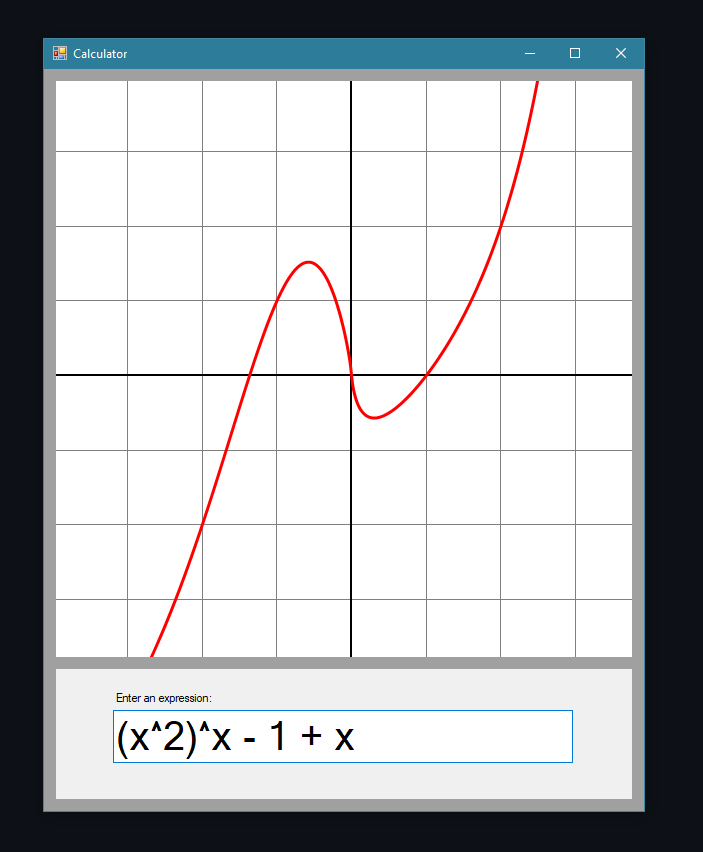

# .NET-GraphicCalculator
Calculator to plot graphics using the .NET Framework

Uses optimized [shunting yard](https://en.wikipedia.org/wiki/Shunting_yard_algorithm) algorithm to parse text expressions. 
Implements control with own paint functions, which color the background, grid lines and graphics.
Mathematical operations are computed in the class MathManager.

# Try some examples and compare it with [Desmus](https://www.desmos.com)!

  
